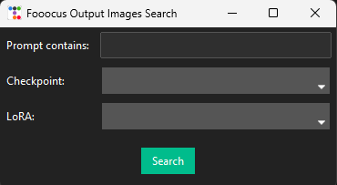
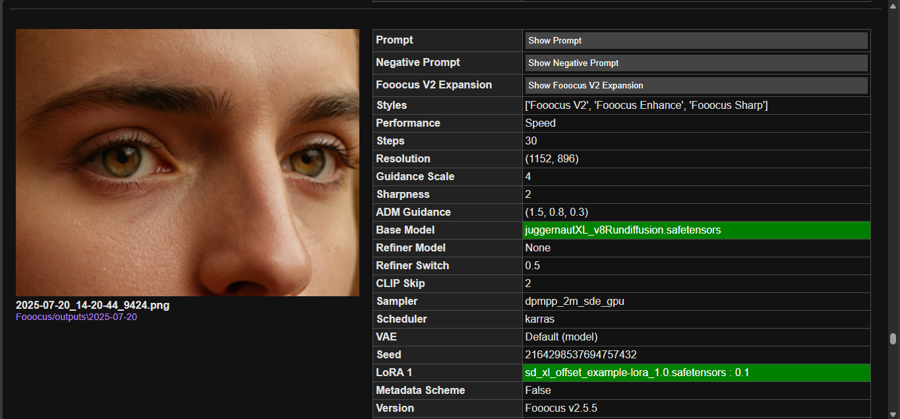

# 📂 Fooocus Output Images Search  
[](https://github.com/) [](https://opensource.org/licenses/MIT)

A simple tool to search all your Fooocus output images by **Prompt**, **Checkpoint**, or **LoRa**.

---

### 🔍 How to Use
1. Download `Parsing.pyw`.  
2. Place it in the same folder as Fooocus (`run.bat` location).  
3. Run the script.  
4. Enter prompts and/or select Checkpoint / LoRa.  
5. An HTML file will be generated and opened in your default browser.

---

### ⚙️ What It Does
- **Dynamic dropdowns** for Checkpoint and LoRa based on local installs.  
- **"Missing Only" search** for images using removed Checkpoints/LoRas.  
- **Color-coded results** for installed vs missing resources.

---

### 🛠 Requirements
```plaintext
pip install beautifulsoup4 ttkbootstrap
```

---

### 📌 Example
```plaintext
Enter prompt: sunset
Select checkpoint: v1.3
Select LoRa: dreamy
```
---

### 📷 Screenshots

#### Main Initial Window
  

#### HTML Output
  


